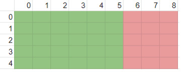
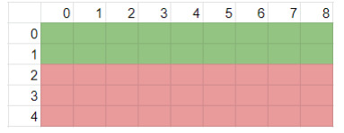
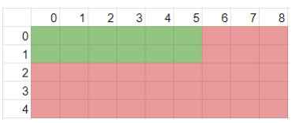

#### TP para la materia Diseño y Analisis de Algoritmos

###### Consigna:

Encontrar la Palabra consiste en un tablero de NxM que en sus posiciones letras, donde recorriendo por filas, columnas o diagonal, siempre hacia abajo, se pueden formar distintas palabras. El problema para resolver consiste en determinar si una palabra dada esta o no en el tablero.

Nota: las palabras se forman en el caso horizontal, desde una posición a la izquierda a una posición a la derecha, en el caso vertical, desde una posición arriba hacia una abajo, y en el caso diagonal, desde una superior izquierda a una inferior derecha. El tablero ingresado puede tener cualquier dimensión.

###### Problema a resolver

Se deberá diseñar un algoritmo en donde se tiene como:
Entrada:

1. Un tablero de NxM con los valores en sus posiciones
2. La palabra a buscar

Salida:
    1.Posiciones en la cual se encuentra ubicada la palabra en el tablero (en el caso de no encontrarse la lista estará vacía)

#### Estrategia de Resolución:

Con el objetivo de encontrar a la palabra buscada, es necesario hacer una búsqueda
exhaustiva en el tablero de los caracteres que la componen. Para ello, será
necesario analizar dentro del conjunto de posiciones contiguas (en sentido
horizontal, vertical, y diagonal) hallando aquellas que indiquen la localización de la
palabra, si es que existe. Se contarán con todas las secuencias posibles. De ellas, se
toma una y se analiza si lleva a alguna solución. En el caso que no, se vuelve a
intentar con otro valor hasta dar con el resultado. En este sentido, se utilizará la
estrategia de backtracking para realizar una búsqueda profunda sobre el tablero y
resolver el problema. Si bien esta estrategia no destaca por su eficiencia, es posible
mejorarla acotando las secuencias a analizar. Es decir, se reduce el espacio de
candidatos a un número menor de potenciales soluciones.

###### Se plantea:

1) Recorrer las posiciones del tablero, comenzando en la esquina superior
   izquierda.
2) Verificar si el carácter en dicha posición coincide con la primera letra de la
   palabra buscada:
   - En el caso negativo, la palabra buscada no comienza en esta posición,
     por lo que se abandona esta posibilidad y se sigue recorriendo el
     tablero.
   - En el caso positivo, existe la posibilidad de que la palabra comience en
     esta posición. Para ello, se comprueba si es viable avanzar por una
     dirección si lo es avanzamos solamente en esa dirección hasta
     verificar si encontramos o no los caracteres restantes, caso contrario
     analizamos la viabilidad de la/s siguiente/s dirección/es, si ningún
     sentido es viable se ha descartado la posición
3) Repetir con el resto de posiciones del tablero si no se encontró la palabra.

###### ¿Cómo comprobamos si es viable avanzar en alguna dirección? :

Para que una palabra de longitud W se encuentre en un tablero de dimensión N x M de cumplirse:

    - Si está de manera horizontal tiene que comenzar en las primeras (M-W) + 1 columnas.

            EJ con W = 4, M = 9 y N = 5

            

    - Si está de manera vertical tiene que comenzar en las primeras (N-W) + 1 filas.

            EJ con W = 4, M = 9 y N = 5

            

    - Si está de manera diagonal tiene que comenzar en las primeras (M-W)+1 columnas y en las primeras(N-W)+1 filas.

             EJ con W = 4, M = 9 y N = 5

            

Por lo tanto, una palabra de longitud W nunca se comenzará en las
posiciones luego de las primeras (M-W)+1 columnas y al mismo
tiempo luego de las primeras (N-W)+1 filas.

La implementacion en java pude verse en la carpeta Proyecto en ResolverEncontrarPalabraImplementacion y puede ejecutarse en Principal

   